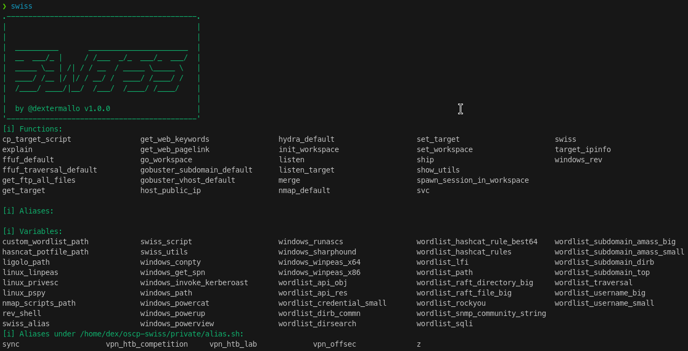

# OSCP Swiss

Swiss Knife on your Kali Linux for OSCP & Bug Bounty.

## 1. About OSCP Swiss

OSCP Swiss is a collection of functions, aliases, and variables to boost your productivity on Kali Linux for OSCP & Bug Bounty. It is designed to help you automate the repetitive tasks, manage your workspace, and provide you with the necessary tools to perform penetration testing.

For example, command `ship` is a one-liner to host a file, and automatically copy-paste the command to fetch the files you need on the target machine. For example:

```bash
ship ./linpeas.sh
# the command will automatically host the file and copy the command for fetching to your click board automatically. All you need is to paste it on the target machine :)
```

There are other commands to help you with the enumeration, exploitation, and post-exploitation, See [3. Usage](#3-usage). You can also customize the settings, add your own scripts, and utilities to the Swiss Knife, See [4. Development & Customization](#4-development--customization). 

## 2. Getting Started

### 2.1. About Environments
>[!NOTE]
> Tested on `Kali 6.8.11-1kali2 (2024-05-30)`, virtualizing using `UTM 4.4.5` on MacBook Pro (M2, Sonoma 14.5)

### 2.2. Prerequisites

You will need to install the following packages. Additionally, if you are not using Kail (version ≥ 6.8.11), you may need to check the script before the run.

> [!CAUTION]
> Some of the commands may need additional libraries or packages. 
> You will see a warning message if you need to install additional packages:
> 

```sh
jq              # (required) parsing configuration
xclip           # (required) click board
docker          # (optional) used in the command `svc docker`
docker-compose  # (optional) used in the command `svc bloodhound`
pygmentize      # (optional) replace `cat` command with syntax highlighting
rlwrap          # (optional) used in the command `listen` for supporting arrow keys
```

### 2.3. Installation

```bash
# download and put it to the home directory
git clone https://github.com/dextermallo/oscp-swiss.git ~

# copy the example settings to the settings.json
# you can customize the settings.json
cd ~/oscp-swiss & cp example.settings.json settings.json

# add the following line to your .zshrc or .bashrc
echo "source ~/oscp-swiss/script/oscp-swiss.sh" >> ~/.zshrc

# All done! Restart your terminal or run the following command
source ~/.zshrc

# (Optional) If you already have any customized scripts, utilities, or wordlist, you can put them in the following directories:
mv ~/my-script.sh ~/oscp-swiss/private/

# you can also find your customized scripts by running the command:
swiss
```

## 3. Usage

### `swiss`: Your Swiss Knife Manual

Description: `swiss` shows all your customized variables, functions, and aliases.

Usage:
```bash
> swiss
```

Example:


### `nmap_default`: Wrapped nmap command with default options

Description: Wrapped nmap command with default options

Usage: 
```bash
# Modes: fast (default), tcp, udp, udp-all, stealth
nmap_default <IP> [mode]
```
<!-- TODO: adding example screenshot -->
Example: 

```bash
nmap_default 192.168.1.1
```

### `svc`: one-liner to host services

Description: one-liner to start services, including docker, ftp, http, smb, ssh, bloodhound, ligolo (extension), wsgi

Usage:

```bash
# service name: docker; ftp; http; smb; ssh; bloodhound; ligolo
svc <service name>
```

Example:
```bash
# to spawn a http server in the current directory
svc http
# to spawn a ftp server in the current directory
svc ftp
```

<!-- TODO: adding example screenshot -->

### `ship`
Description: one-liner to ship files to the target machine. With no copy-paste needs.
Usage: 
```bash
#   -t|--type: linux|windows (default: linux)
#   -a|--auto-host-http: auto-host the http server (default: true)
ship [-t|--type linux|windows] [-a|--auto-host-http] <filepath>
```

Example:
```bash
ship ./rce.sh
ship -t windows ./rce.exe
```

<!-- TODO: adding example screenshot -->
### `listen`

Description: One-liner to start a reverse shell listener, warpped with rlwrap to make the reverse shell interactive

# Usage:
```bash
listen <port>
```

<!-- TODO: adding example screenshot -->

### `ffuf_default`
<!-- TODO: adding example screenshot -->
### `ffuf_traversal_default`
<!-- TODO: adding example screenshot -->
### `gobuster_subdomain_default`
<!-- TODO: adding example screenshot -->
### `gobuster_vhost_default`
<!-- TODO: adding example screenshot -->
### `hydra_default`
<!-- TODO: adding example screenshot -->
### `get_web_pagelink`
<!-- TODO: adding example screenshot -->
### `get_web_keywords`
<!-- TODO: adding example screenshot -->
### `set_target` & `get_target`
<!-- TODO: adding example screenshot -->
### `cp_target_script`
<!-- TODO: adding example screenshot -->
### `listen_target`
<!-- TODO: adding example screenshot -->
### `init_workspace`, `set_workspace`, & `get_workspace`
<!-- TODO: adding example screenshot -->
### `spawn_session_in_workspace`
<!-- TODO: adding example screenshot -->
### `merge`
<!-- TODO: adding example screenshot -->
### `get_ftp_all_files`
<!-- TODO: adding example screenshot -->
### `target_ipinfo`
<!-- TODO: adding example screenshot -->
### `host_public_ip`
<!-- TODO: adding example screenshot -->
### `show_utils`
<!-- TODO: adding example screenshot -->
### `explain`
<!-- TODO: adding example screenshot -->

## 4. Development & Customization

Here are the key structure for swiss:

```md
.
├── data             # (Private) common data/material for testing 
│   ├── ...
│   └── test.jpg
├── private          # (Private) you can put your customized script, ovpn file, etc.
│   ├── myscript.sh
│   └── lab.ovpn
├── script           #  (Public) main script for swiss
├── utils            # (Private) put your binaries, compiled files, utilities (e.g., pspy)
│   └── ...
├── wordlist         # (Private) custom wordlist
└── settings.json
```

## 5. License

This project is licensed under the MIT License - see the [LICENSE.md](LICENSE.md) file for details

<!-- ## Acknowledgments -->