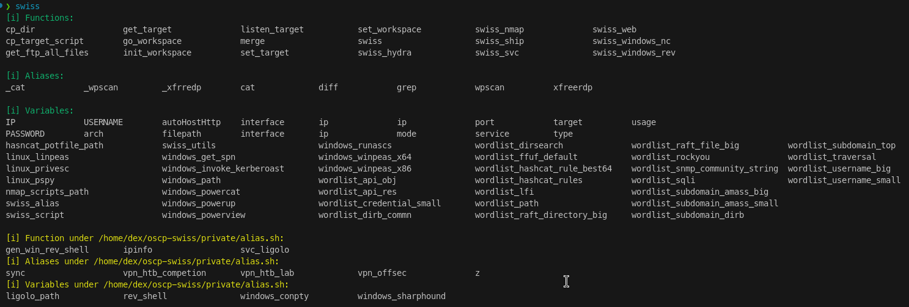

# OSCP Swiss

Swiss Knife on your Kali Linux for OSCP & Bug Bounty.

## 1. About OSCP Swiss

These instructions will get you a copy of the project up and running on your local machine for development and testing purposes. See deployment for notes on how to deploy the project on a live system.

## 2. Getting Started

### 2.1. About Environments
>[!NOTE]
> Tested on `Kali 6.8.11-1kali2 (2024-05-30)`, virtualizing using `UTM 4.4.5` on MacBook Pro (M2, Sonoma 14.5)

You will need the following packages:

### 2.2. Prerequisites

You will need to install the following packages. Additionally, if you are not using Kail (version ≥ 6.8.11), you may need to check the script before the run.

```sh
jq
pygmentize
rlwrap
xclip
docker
docker-compose
```

### 2.3. Installation

```bash
# download and put it to the home directory
git clone https://github.com/dextermallo/oscp-swiss.git ~

# copy the example settings to the settings.json
# you can customize the settings.json
cd ~/oscp-swiss & cp example.settings.json settings.json

# add the following line to your .zshrc or .bashrc
echo "source ~/oscp-swiss/script/oscp-swiss.sh" >> ~/.zshrc
```

## 3. Usage

<details>
<summary><code>swiss</code></summary>

> Description: `swiss` shows all your customized variables, functions, and aliases. 

```bash
# Usage
> swiss
```



</details>

## 4. Development & Customization

Here are the key structure for swiss:

```md
.
├── data             # (Private) common data/material for testing 
│   ├── ...
│   └── test.jpg
├── private          # (Private) you can put your customized script, ovpn file, etc.
│   ├── myscript.sh
│   └── lab.ovpn
├── script           #  (Public) main script for swiss
├── utils            # (Private) put your binaries, compiled files, utilities (e.g., pspy)
│   └── ...
├── wordlist         # (Private) custom wordlist
└── settings.json
```

## 5. License

This project is licensed under the MIT License - see the [LICENSE.md](LICENSE.md) file for details

<!-- ## Acknowledgments -->