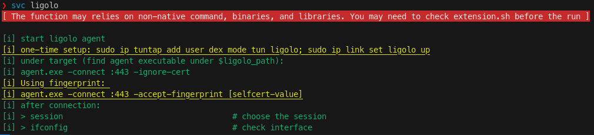

# OSCP Swiss

Swiss Knife on your Kali Linux to help you move fast.

## 1. About OSCP Swiss

OSCP Swiss is a collection of functions, aliases, and variables to boost your productivity on Kali Linux. It is designed to help you automate the repetitive tasks, manage your workspace, and provide you with the necessary tools to perform penetration testing.

For example, command `ship` is a one-liner to host a file, and automatically copy-paste the command to fetch the files you need on the target machine. For example:

```bash
ship ./linpeas.sh
# the command will automatically host the file and copy the command for fetching to your click board automatically. All you need is to paste it on the target machine :)
```

A quick demos for shipping multiple files at a time:


> ![tips]
> it is powerful when you have a set of frequent-used tools. For example:
> ```bash
> # under /script/extension.sh
> # I have a set of utilities that I often use for enumerate on Windows
> windows_family=( $windows_mimikatz_x64 $windows_winpeas_x64 $windows_powerview $windows_powerup ... )
> 
> # I can easily get all of them on the target VM by:
> ship -t windows $windows_family
> ```

There are other commands to help you with the enumeration, exploitation, and post-exploitation, See [3. Usage](#3-usage). You can also customize the settings, add your own scripts, and utilities to the Swiss Knife, See [4. Development & Customization](#4-development--customization). 

## 2. Getting Started

### 2.1. About Environments
>[!NOTE]
> Tested on `Kali 6.8.11-1kali2 (2024-05-30)`, virtualizing using `UTM 4.4.5` on MacBook Pro (M2, Sonoma 14.5)

>[!Caution]
> The script is designed to work on Kali Linux. It may not work on other Linux distributions. > Meanwhile, the scripts are developed and tested under Zsh (v5.9). There might be some issues if you are using Bash. PRs and Issues welcome!

### 2.2. Prerequisites

You will need to install the following packages. Additionally, if you are not using Kail (version ≥ 6.8.11), you may need to check the script before the run.

> [!CAUTION]
> Some of the commands may need additional libraries or packages. 
> You will see a warning message if you need to install additional packages:
> 

```sh
jq              # (required) parsing configuration
xclip           # (required) click board
docker          # (optional) used in the command `svc docker`
docker-compose  # (optional) used in the command `svc bloodhound`
pygmentize      # (optional) replace `cat` command with syntax highlighting
rlwrap          # (optional) used in the command `listen` for supporting arrow keys
```

### 2.3. Installation

```bash
# download and put it to the home directory
git clone https://github.com/dextermallo/oscp-swiss.git ~

# copy the example settings to the settings.json
# you can customize the settings.json
cd ~/oscp-swiss & cp example.settings.json settings.json

# add the following line to your .zshrc or .bashrc
echo "source ~/oscp-swiss/script/oscp-swiss.sh" >> ~/.zshrc

# All done! Restart your terminal or run the following command
source ~/.zshrc

# (Optional) If you already have any customized scripts, utilities, or wordlist, you can put them in the following directories:
mv ~/my-script.sh ~/oscp-swiss/private/

# you can also find your customized scripts by running the command:
swiss
```

### 2.4. Updates

```bash
# pull the latest changes
cd ~/oscp-swiss & git pull

# noted that you may need to update your settings.json if there are any changes
# and restart your terminal
source ~/.zshrc
```

## 3. Usage

> ![Tip]
> To keep the README concise, the following sections only provide a short description and examples. You can find more detailed information by running the command `<command> -h` or read it under the `/script` directory.

Functions are breaking down into the modules and main functions. For more information, see [4. Development & Customization](#4-development--customization).

>[!TIP]
> You can find configurations for functions under `/settings.json`. For example:
> ```json
> {
>     "global_settings": { ... },
>     "functions": {
>         "wpscan": {
>             "token": "your_token_here"
>         }
>     }
> }
> ```

### 3.1. Main Functions

#### 3.1.1. `swiss`
#### 3.1.2. `cd` (customized)
#### 3.1.3. `xfreerdp` (customized)
#### 3.1.4. `wpscan` (customized)
#### 3.1.5. `cat` (customized)
#### 3.1.6. `ls` (customized)
#### 3.1.7. `i`: get the default IP address


#### 3.1.8. `svc`: start service with simplicity

<video src='demo/command-svc.mov'/>

#### 3.1.9. `ship`: killer tool for file transfer

<video src='demo/command-ship.mov'/>

#### 3.1.10. `listen`: wrap the nc listener.

<video src='demo/command-listen.mov'/>

#### 3.1.7. About Variables
#### 3.1.8. About Extension


### 3.5. Module/bruteforce

## 4. Development & Customization

Here are the key structure for swiss:

```md
.
├── data             # (Private) common data/material for testing 
│   ├── ...
│   └── test.jpg
├── private          # (Private) you can put your customized script, ovpn file, etc.
│   ├── myscript.sh
│   └── lab.ovpn
├── script           #  (Public) main script for swiss
├── utils            # (Private) put your binaries, compiled files, utilities (e.g., pspy)
│   └── ...
├── wordlist         # (Private) custom wordlist
└── settings.json
```

## 5. License

This project is licensed under the MIT License - see the [LICENSE.md](LICENSE.md) file for details

<!-- ## Acknowledgments -->