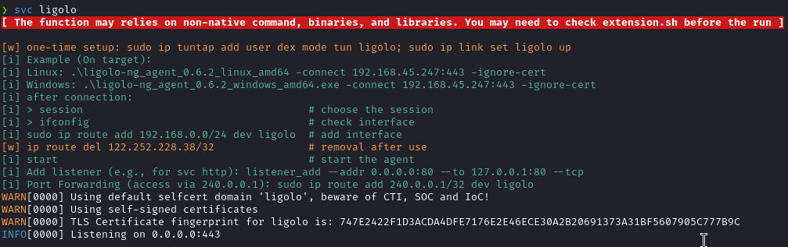

# OSCP Swiss

Swiss Knife on your Kali Linux to help you automate the work.

>[!CAUTION]
> For fokls who use OSCP Swiss for the exam, do check the scripts by yourself!
> My version used in the exam: v1.5.3

## 1. About OSCP Swiss

OSCP Swiss is a collection of functions, aliases, and variables designed to boost productivity on Kali Linux. It helps you automate repetitive tasks, manage your workspace, and provide the necessary tools to perform penetration testing.

For example, the command `ship` is a one-liner command to drop a file from your Kali to the target machine. For example:

```bash
ship ./linpeas.sh
# The command will automatically host the file and copy the command to fetch it to your click board automatically.
# All you need is to paste it on the target machine :)
```

Here is a quick demo for shipping multiple files at a time:

https://github.com/user-attachments/assets/895d3a44-56a9-437e-99b2-85262815b2ff

> ![TIPS]
> It is powerful when you have a set of frequently used tools. For example:
> ```bash
> # under /script/extension.sh
> # I have a set of utilities that I often use for enumerate on Windows
> windows_family=( $windows_mimikatz_x64 $windows_winpeas_x64 $windows_powerview $windows_powerup ... )
> 
> # I can easily get all of them on the target VM by:
> ship -t windows $windows_family
> ```

Another my favorite is the `session`. Have you ever tired of typing the target IP address, domain name, and switich to your workspace across different terminal session?
`session` is a powerful commands, it helps you to set up a "stick session", which, whenever you spawn a new terminal, you will set all the things up.

With `session`, you are no longer needs to type the IP address anymore. For example:
```bash
ping $ip
curl http://$ip:8080
```

See:


> ![TIPS]
> "sticky session" is configurable. see [3.1.1. About Globbal Settings](#3-1-1-about-globbal-settings)

There are other commands to help you with the enumeration, exploitation, and post-exploitation. See [3. Usage](#3-usage). You can also customize the settings and add your own scripts and utilities to the Swiss Knife. See [4. Development & Customization](#4-development--customization). 

## 2. Getting Started

### 2.1. About Environments
>[!NOTE]
> Tested on `Kali 6.8.11-1kali2 (2024-05-30)`, virtualizing using `UTM 4.4.5` on MacBook Pro (M2, Sonoma 14.5)

>[!CAUTION]
> The script is designed to work on Kali Linux. It may not work on other Linux distributions.
> the scripts are developed and tested under Zsh (v5.9). There might be some issues if you are using Bash. PRs and Issues are welcome!

### 2.2. Prerequisites

You will need to install the following packages. Additionally, you may need to check the script before the run if you are not using Kail (version ≥ 6.8.11).

> [!CAUTION]
> Some of the commands may need additional libraries or packages. 
> You will see a warning message if you need to install additional packages:
> 

```sh
gum             # (required) prompt / input control
jq              # (required) parsing configuration
gum             # (required) interactive commands
xclip           # (required) clickboard copy-paste
docker          # (optional) used in the command `svc docker`
docker-compose  # (optional) used in the command `svc bloodhound`
pygmentize      # (optional) replace `cat` command with syntax highlighting
rlwrap          # (optional) used in the command `listen` for supporting arrow keys
```

### 2.3. Installation

```bash
# Download and put it in the home directory
cd $HOME && git clone https://github.com/dextermallo/oscp-swiss.git

# copy the example settings to the settings.json
# you can customize the settings.json
cd $HOME/oscp-swiss && cp example.settings.json settings.json

# Add the following line to your .zshrc or .bashrc
echo "\nsource ~/oscp-swiss/script/oscp-swiss.sh" >> ~/.zshrc

# All done! Restart your terminal or run the following command
source ~/.zshrc

# (Optional) If you already have any customized scripts, utilities, or wordlists, you can put them in the following directories:
mv ~/my-script.sh ~/oscp-swiss/private/

# you can see all the supported modules by:
swiss -h

# you can also find your customized scripts by running the command:
swiss private
```

### 2.4. Updates
```bash
# pull the latest changes
cd ~/oscp-swiss & git pull

# noted that you may need to update your settings.json if there are any changes
# and restart your terminal
source ~/.zshrc
```

## 3. Usage
> ![TIP]
> To keep the README concise, the following sections only provide a short description and examples. You can find more detailed information by running the command `<command> -h` or read it under the `/script` directory.

### 3.1. Configurations
Functions are broken down into modules. You can find 

You can find configurations for functions under `/settings.json`. For example:

These configurations will parse with a prefix `_swiss` and use across the scripts.

```json
{
    "global_settings": { ... },
    "modules": {
        "alias": {
            "wpscan_token": "your_token_here"
        },
        "session": {
            "sticky_session": true
        }
    }
}
```

#### 3.1.1. About Globbal Settings
Under `/settings.json`, there is a `global_settings` attribute.

### 3.2. Alias
> ![TIP]
> alias.sh is a collection of alias commands that are used across the oscp-swiss scripts.
> The functions under alias.sh are the default commands that are replaced with the custom commands.

Example:
```bash
wordlist_username_big="$_swiss_wordlist_base/seclists/Usernames/xato-net-10-million-usernames.txt"

# and you can use it like:
hydra -U $wordlist_username_big -p password ssh://10.10.10.10
```

### 3.3. Extension
> ![CAUTION]
> The extension.sh is for the non-native functions that are used in the script.
> You may need to download the tools and scripts or modify the path to use them.
> for extension function, you should use the `_banner extension <extension_name>` function to display the banner
> to inform the user that the function is an extension function.

Example:
```bash
windows_GodPotato="$HOME/oscp-swiss/utils/windows/GodPotato"

# you can use it with the command `ship`
ship $windows_GodPotato
```

### 3.4. Module: Common

#### 3.4.1. `svc`: start service without pain


#### 3.4.2. `ship`: killer tool for file transfer

https://github.com/user-attachments/assets/ee3838a1-a35e-410b-9e35-a9b404b68247

#### 3.4.3. `listen`: wrap the nc listener.


#### 3.4.4. `cheatsheet`: Find Cheatsheet in your terminal.
> ![TIP]
> `cheatsheet` is helpful for the things you will frequently-used, such as commands to upgrade to fully-TTy


### 3.5. Module: Session

#### 3.5.1. `session`: Cross-session Terminal to Help You Focus, Nagivate, and Reduce Memorization


## 4. Development & Customization

Here are the primary structures for swiss:

```md
.
├── data                 # common data/material for testing 
│   ├── ...
│   └── test.jpg
├── doc 
│   └── cheatsheet       # quick cheatsheet for copy-paste, review, etc. See command `cheatsheet`.
├── private              # you can put your customized script, .ovpn file, etc.
│   ├── myscript.sh
│   └── lab.ovpn
├── script               # main script for swiss
│   ├── module           # modules
│   ├── target           # scripts for the target side
│   ├── utils            # utilities script for internal use.
│   ├── alias.sh         # alias for native resources (i.e., binaries, executables) on Kali
│   ├── extension.sh     # alias for external resources
│   └── oscp-swiss.sh    # main script
├── utils                # put your binaries, compiled files, utilities (e.g., pspy, linpeas)
│   └── ...
├── wordlist             # custom wordlist
├── nstallation.sh       # (WIP) installation for creating wordlist, downloading binaries, etc.
└── settings.json
```

## 5. License

This project is licensed under the MIT License - see the [LICENSE.md](LICENSE.md) file for details

<!-- ## Acknowledgments -->
